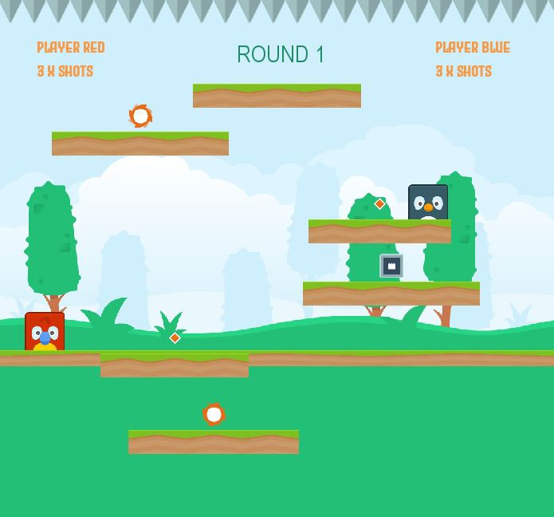
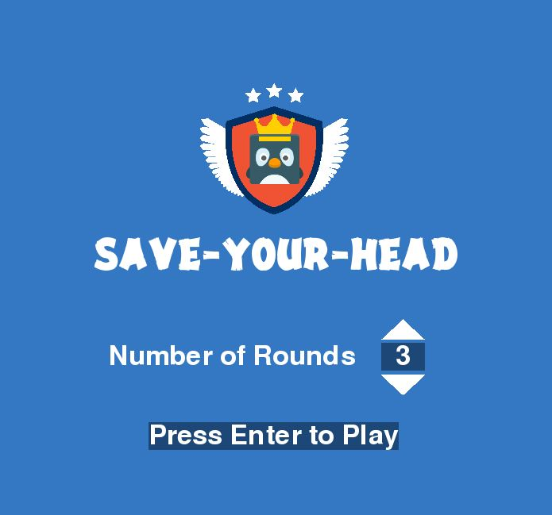
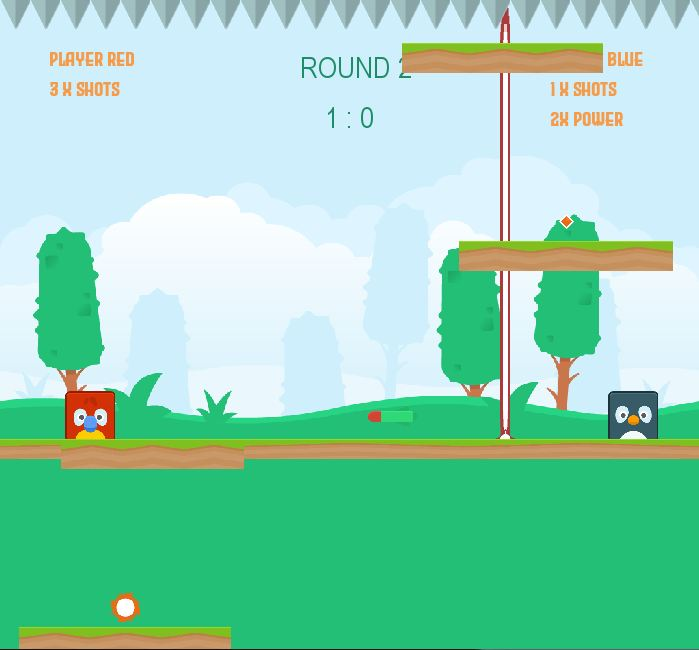

# Save-Your-Head

A Two Player game with a fight to save their heads.

  

## Game Info

 - Player are two cute box animals. Each Player attempt to sit on other
   player head.
   
- They are helped by powerups like 2X Boosters and Bullet
   shots. 
   
 - Laser and Bombs are also threats to our player. 

 - And did I mentioned the thorn to avoid at top and hostile speed of platforms   increase after every half-minute.

## How to Play

Make pure you have python 3.x.

 1. Clone the repo using  this command in command line `git clone https://github.com/amifunny/Save-Your-Head.git`
 2. Inside the folder run command `pip install -r requirements.txt`.
 3.  Double click `game.py` or use command line to execute `python game.py`

## Control

I should have provided this control info inside the game. but... here it is.

Player1 -
W - Jump ;  A - Move Left ; D -Move Right ; 
E - To shoot bullet in direction you were last moving

Player2 -
ArrowUp - Jump ;  ArrowLeft - Move Left ; ArrowRight -Move Right ; 
Right CTRL - To shoot bullet in direction you were last moving

## Motivation

This is my first game.

I was trying to create a platform jumping box game but wanted to do something new.

 So Inspired by thumb fight, made it into a fighting arena and like thumb fight, one player tries to press another below him.
 
Later added Laser, Bombs and Powerup for more Fun and these are served over upward moving platform.

## Resources

I would to thanks and attribute some resources that helped me develop this game for free.

- [kenny](https://kenney.nl/) - For character and all image assets
- [FreeSound](https://freesound.org/) - For background and impact sounds
- [FontSpace](https://www.fontspace.com/) - For some cool fonts
